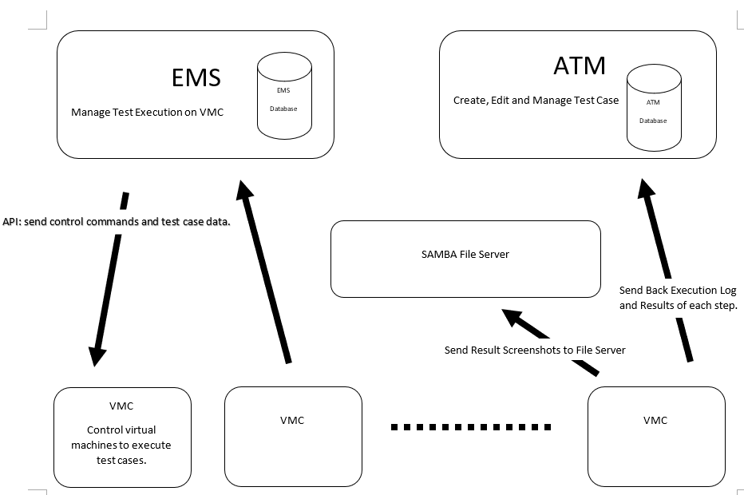
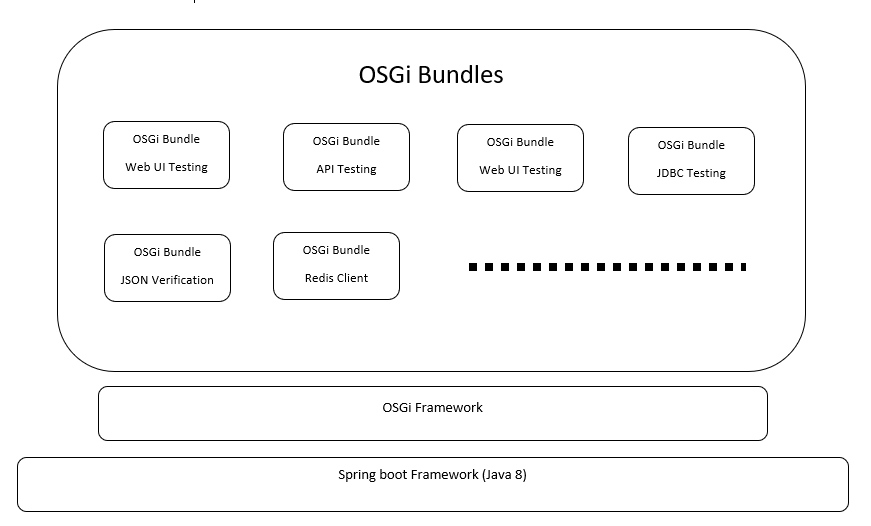

# **Design Concept**

\#\#\#\#\#\#\#\#\#\#\#\#\#\#\#\#\#\#\#\#\#\#\#\#\#\#\#\#\#\#\#\#\#\#\#\#\#\#\#\#\#\#\#\#\#\#\#\#\#\#\#\#\#\#\#\#\#\#\#\#\#\#\#\#\#\#\#\#\#\#\#\#\#\#\#\#\#\#

LittleBoy act as the UI frontend of AlcheDesk. It has its database,
which stores all the user login info and permission control data. We
built LittleBoy on a Laravel framework with Vue.

ATM stores all the test case data and execution results. It also has the
feature to schedule test case executions cron jobs. ATM can process test
case data and repackage them, then send them to EMS.

EMS stores the data about VMC machines. The main feature of EMS is
managing the VMC machines to execute test cases.

SAMBA server store the screenshot from VMC. LittleBoy accesses those
files to display on the UI.

=============================================================================

EMS send test case to corresponding VMC machine for execution.

VMC will send back the execution log to ESM with machine status. On the
other hand, VMC also sends the step execution result of each test case
back to ATM for real-time test case execution update. Screenshot from
all execution will send from VMC directly to the Samba server.

=============================================================================

The VMC is using the OSGi framework underneath. Every OSGi bundle is a
testing feature module, which can communicate with each other. This
design allows developers to add a new testing feature by adding a new
Bundle.

# 

# **Configuration**

\#\#\#\#\#\#\#\#\#\#\#\#\#\#\#\#\#\#\#\#\#\#\#\#\#\#\#\#\#\#\#\#\#\#\#\#\#\#\#\#\#\#\#\#\#\#\#\#\#\#\#\#\#\#\#\#\#\#\#\#\#\#\#\#\#\#\#\#\#\#\#\#\#\#\#\#\#\#

-   ## Little Boy

> Please check the configuration file (.env.example) under [AlcheDesk
> LittleBoy Project](https://github.com/AlcheDesk/LittleBoy) for more
> details.

-   ## ATM

Please check the configuration file (application.yml) under [AlcheDesk
ATM Project](https://github.com/AlcheDesk/ATM) for more details.

-   ## EMS

Please check the configuration file (application.yml) under [AlcheDesk
EMS Project](https://github.com/AlcheDesk/EMS) for more details.

-   ## VMC

Please check the configuration file (application.yml) under [AlcheDesk
VMC Project](https://github.com/AlcheDesk/VMC) for more details.

# **User Manual**

\#\#\#\#\#\#\#\#\#\#\#\#\#\#\#\#\#\#\#\#\#\#\#\#\#\#\#\#\#\#\#\#\#\#\#\#\#\#\#\#\#\#\#\#\#\#\#\#\#\#\#\#\#\#\#\#\#\#\#\#\#\#\#\#\#\#\#\#\#\#\#\#\#\#\#\#\#\#

The user manual is on the GitBook now, and please check it out by the
following link.

[AlcheDesk User Manual](https://alchedesk.gitbook.io/user-manual/)
