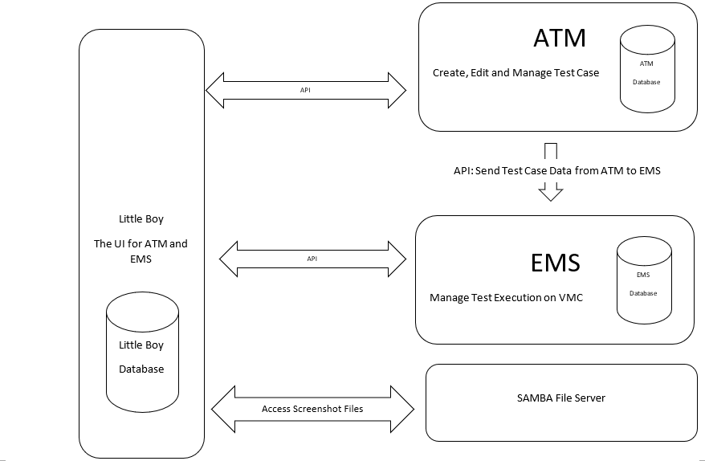

# Design Concept

# Configuration

-   ## Global

-   ## ATM

-   ## EMS

-   ## VMC

# User Manual

The user manual is on the GitBook now, and please check it out by the
following link.

[AlcheDesk User Manual](https://alchedesk.gitbook.io/user-manual/)
